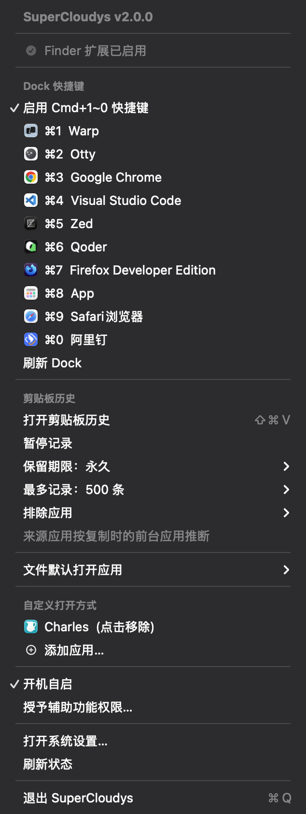

# SuperCloudys

原生 macOS 桌面增效工具：Finder 右键菜单、Dock 全局快捷键、剪贴板历史和菜单栏管理。

## 功能

### Finder 右键菜单

- 通过 VSCode、Zed、Warp、Kaku 或自定义 `.app` 打开所选文件/目录
- 按 Bundle ID 定位已安装应用，支持 `/Applications` 之外的安装位置
- 复制一个或多个所选项目的完整路径
- 自定义应用变更会由 Finder 扩展后台刷新

### Dock 全局快捷键

- 默认关闭，可在菜单栏按需开启
- `Cmd+1` ~ `Cmd+9`、`Cmd+0` 对应 Dock 前 10 个应用
- 未运行时启动，后台时聚焦，前台时轮换窗口，轮换完成后隐藏
- 使用文件系统事件自动跟随 Dock 变化，无后台轮询
- 菜单栏会直接显示快捷键注册冲突

### 剪贴板历史

- `Ctrl+H` 打开跟随鼠标位置的历史面板
- 支持文本、URL、文件组、图片和颜色
- 搜索、类型过滤、固定、删除、复制和粘贴到先前应用
- 可暂停记录，设置 1/7/30/90 天保留期和 100/500/1000 条上限
- 可按应用排除记录；默认排除常见密码管理器
- 忽略 transient/concealed 数据，图片与缩略图随历史记录一同清理
- 单条文本上限 2 MiB，图片上限 5000 万像素/100 MiB，避免异常负载拖垮常驻进程

剪贴板来源应用由检测到变化时的前台应用推断。立即粘贴需要辅助功能权限；未授权时仍可使用“复制”。

### 菜单栏管理

- Finder 扩展、辅助功能、快捷键冲突和开机自启状态
- 打开/暂停剪贴板历史及隐私设置
- 查看和修改指定后缀的系统默认打开应用
- 添加/移除 Finder 右键菜单中的自定义应用

<p align="center">
  
</p>

## 系统要求

- macOS 14.0 Sonoma 或更高版本
- Xcode 15+ 与 XcodeGen（从源码构建）

## 安装

### Release

从 [Releases](../../releases) 下载已签名并公证的 DMG，将 `SuperCloudys.app` 拖入 `/Applications`。

首次安装后：

1. 在“系统设置 → 登录项与扩展 → 添加的扩展”启用 Finder 扩展。
2. 如需窗口轮换和立即粘贴，在菜单栏点击“授予辅助功能权限…”。

### 本地开发

```bash
brew install xcodegen
xcodegen generate
./scripts/install-local.sh
```

`install-local.sh` 使用长期自签证书安装到 `~/Applications`，因此本地重建不会反复丢失 TCC 权限。该证书仅用于本机开发，公开 Release 使用 Developer ID。

手动测试：

```bash
xcodegen generate
xcodebuild test \
  -project SuperCloudys.xcodeproj \
  -scheme SuperCloudysTests \
  -destination "platform=macOS,arch=$(uname -m)"
```

## 使用

### Finder

选中文件或目录后打开右键菜单，选择“通过 … 打开”或“复制路径”。若菜单未出现，先确认 Finder 扩展已启用，再在菜单栏点击“刷新状态”。

### Dock 快捷键

- 第一次按快捷键：启动或聚焦对应应用
- 应用已在前台：依次轮换窗口，最后一次隐藏应用
- 未授予辅助功能权限：启动/聚焦仍可用，窗口轮换会降级为隐藏

### 剪贴板面板

- `↑` / `↓`：移动选择
- `Return`：复制选中条目
- `Cmd+Return`：粘贴到打开面板前的应用
- `Cmd+C`：复制选中条目
- `Cmd+.`：固定/取消固定
- `Cmd+Delete`：删除选中条目
- `Tab` / `Shift+Tab`：切换类型过滤
- `Esc`：关闭

历史元数据位于 `~/Library/Application Support/SuperCloudys/clipboard_history.json`，图片位于同目录的 `ClipboardAssets`；文件仅对当前用户开放。

## 架构

- `SuperCloudys/`：菜单栏主应用、Dock 快捷键、剪贴板历史
- `SuperCloudysExtension/`：沙盒化 Finder Sync 扩展
- `Shared/`：主应用和扩展共享的模型及自定义应用配置
- `project.yml`：XcodeGen 项目配置

关键实现：

- Carbon `RegisterEventHotKey` 注册全局快捷键
- `DispatchSourceFileSystemObject` 监听 Dock plist
- `.utility` GCD timer 监听 `NSPasteboard.changeCount`
- 图片在剪贴板后台队列完成压缩和原子落盘后才发布到 UI
- Finder 菜单使用文件事件驱动的后台快照，主线程只组装 `NSMenu`
- JSON + 内存过滤覆盖默认 500 条历史；未引入数据库或第三方运行时依赖

## 发布

推送 `v*` tag 会运行测试、Developer ID 签名、DMG 公证和 GitHub Release。仓库需配置：

- `DEVELOPER_ID_CERTIFICATE_BASE64`
- `DEVELOPER_ID_CERTIFICATE_PASSWORD`
- `DEVELOPER_ID_APPLICATION`
- `KEYCHAIN_PASSWORD`
- `APPLE_ID`
- `APPLE_TEAM_ID`
- `APPLE_APP_SPECIFIC_PASSWORD`

版本由 tag 注入 `MARKETING_VERSION`，构建号使用 GitHub Actions run number。

```bash
git tag v2.1.0
git push origin v2.1.0
```

## Finder 右键卡顿排查

```bash
./scripts/diagnose_rightclick.sh
```

Finder 会等待所有已启用的 Finder Sync 扩展返回菜单；卡顿不一定来自 SuperCloudys。诊断脚本会采样 Finder、检查扩展日志并读取 spindump。

## License

MIT
